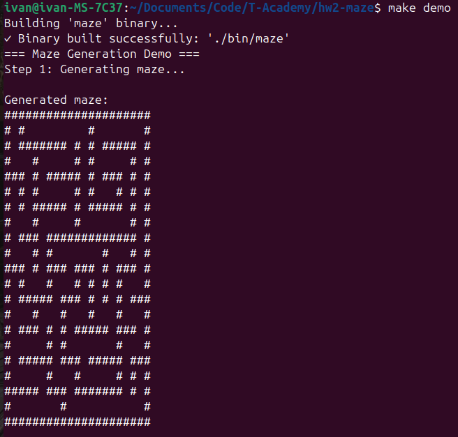
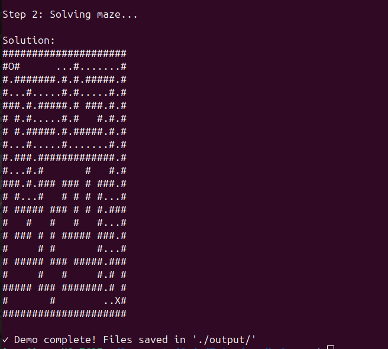

# 🌀 Maze

Консольное приложение на Go для генерации лабиринтов и поиска пути в них.

## Quick Start

```bash
git clone https://github.com/kurochkinivan/maze.git
cd maze

# Сгенерировать лабиринт 10x10
go run ./cmd/maze generate --width=10 --height=10

# Решить лабиринт
go run ./cmd/maze generate --width=10 --height=10 --output=maze.txt
go run ./cmd/maze solve --file=maze.txt --start=0,0 --end=9,9

# Через pipe
go run ./cmd/maze generate --width=10 --height=10 | go run ./cmd/maze solve --start=0,0 --end=9,9
```

## Скриншоты




## Команды

### `generate` — генерация лабиринта

| Флаг | Описание | По умолчанию |
|------|----------|--------------|
| `--algorithm` | Алгоритм генерации: `dfs`, `prim` | `dfs` |
| `--width` | Ширина лабиринта | — |
| `--height` | Высота лабиринта | — |
| `--output` | Файл для сохранения (иначе stdout) | — |
| `--unicode`, `-u` | Псевдографика Unicode | — |

### `solve` — решение лабиринта

| Флаг | Описание | По умолчанию |
|------|----------|--------------|
| `--algorithm` | Алгоритм поиска: `astar`, `dijkstra` | `astar` |
| `--file` | Файл с лабиринтом (`-` для stdin) | — |
| `--start` | Начальная точка `x,y` | — |
| `--end` | Конечная точка `x,y` | — |
| `--output` | Файл для сохранения (иначе stdout) | — |
| `--unicode`, `-u` | Псевдографика Unicode | — |

## Алгоритмы

**Генерация:** DFS (поиск в глубину), алгоритм Прима

**Решение:** A* с эвристикой Manhattan distance, алгоритм Дейкстры

## Формат файла

```
###########
# #   #   #
# ### # ###
#   #   # #
### ##### #
#         #
###########
```

Обозначения: `#` — стена, ` ` — проход, `O` — старт, `X` — финиш, `.` — путь решения

## Make

```bash
make generate           # Сгенерировать лабиринт 10x10 → ./output/maze.txt
make solve              # Решить лабиринт → ./output/maze_solution.txt
make generate-and-solve # Генерация + решение одной командой
make demo               # Полная демонстрация с выводом в консоль
make test               # Запустить тесты с отчётом покрытия
make build              # Собрать бинарный файл → ./bin/maze
make clean              # Удалить артефакты
```

## Тестирование

```bash
make test
```

Unit-тесты покрывают алгоритмы генерации и решения, ввод/вывод, основные методы `maze.Maze`. Покрытие — **74%**. Дополнительно реализован интеграционный тест совместной работы генератора и солвера, а также black-box тесты (**100%**).